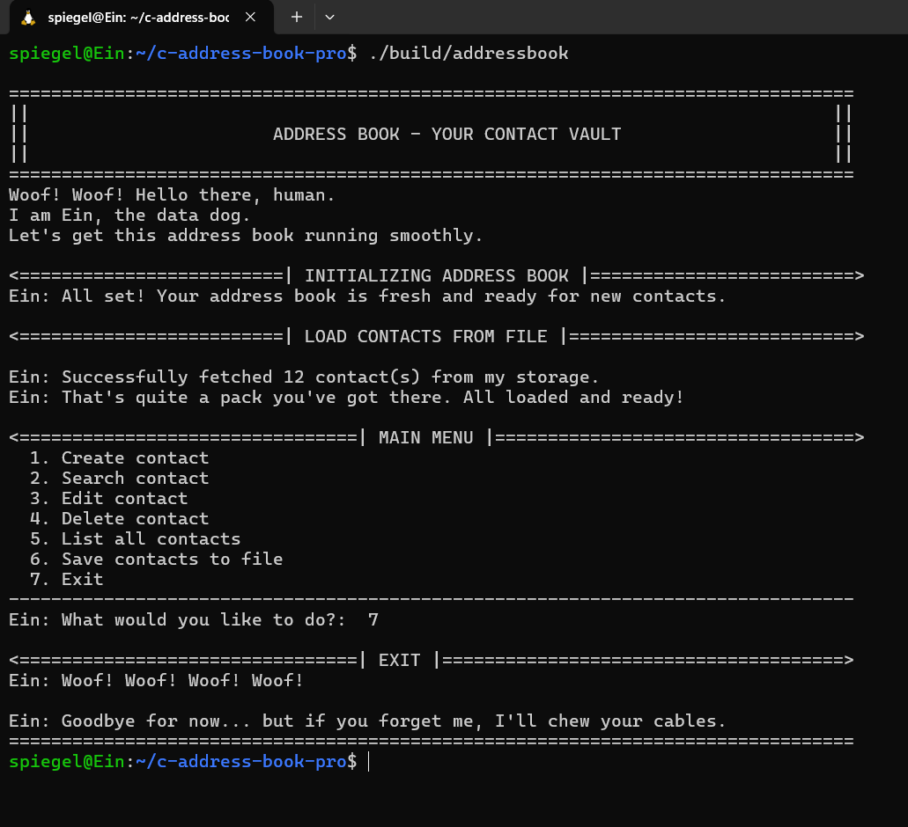
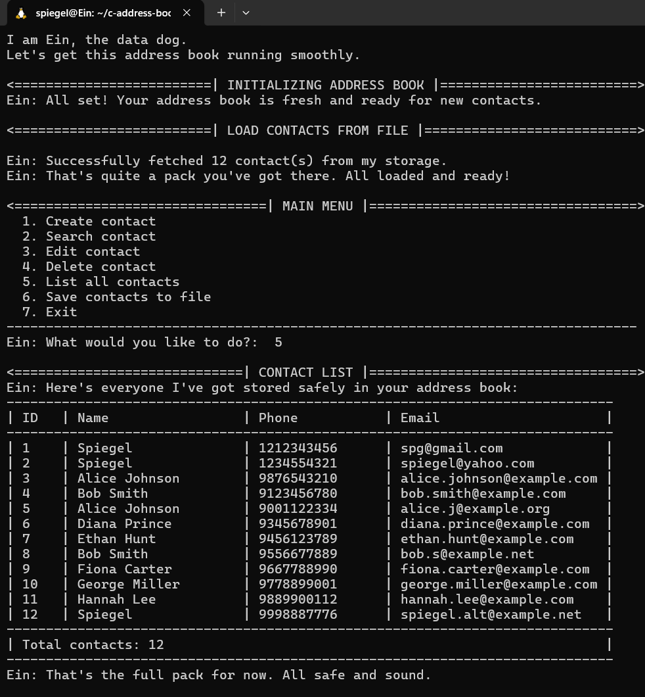

# C Address Book — Professional Edition


<table>
  <tr>
    <td></td>
    <td></td>
  </tr>
</table>


A simple, robust, and professional command-line address book application written in C. This project demonstrates core C programming concepts, including linked lists, dynamic memory management, file I/O, and a modular, professional architecture.

This project was built from the ground up in a WSL/Linux environment and utilizes a full suite of professional development tools, including CMake, clang-format, static analysis, and a Doxygen-ready documentation standard. It is fully cross-platform and can also be compiled on Windows using the MinGW toolchain.

* The application is themed around "**🐾 Ein, the data dog,**" who guides the user through the experience.*

## Features
**Create Contacts:** Add new contacts with a multi-stage, robust validation system for names, phone numbers, and emails.

**List All Contacts:** View all saved contacts in a clean, formatted table with unique IDs.

**Dynamic & Memory Safe:** Uses a singly linked list for dynamic contact storage, with a complete and correct implementation of ```malloc``` and ```free``` to prevent memory leaks.

**Data Persistence:** Seamlessly saves the address book to a ```contacts.csv``` file and automatically loads it on startup.

**Modular Design:** Code is separated into logical modules (```address_book```,```contact_helper```) for clarity, maintainability, and reusability.

(Note: Search, Edit, and Delete functions are currently placeholders, with their future implementation tracked in the project's GitHub Issues.)

---

## Project Structure
This project follows a clean, professional, and scalable directory structure:
```
.
├── .gitignore
├── CMakeLists.txt
├── Doxyfile
├── LICENSE
├── README.md
├── assets/
│   └── demo_test.gif
├── build/
├── include/
│   ├── address_book.h
│   └── contact_helper.h
├── src/
│   ├── address_book.c
│   ├── contact_helper.c
│   └── main.c
└── test/
    ├── CMakeLists.txt
    └── test_initialize.c
```
---

## 🛠️ Technology Stack & Workflow

| Category         | Tool/Standard |
|------------------|---------------|
| Language         | C (C11) |
| Build System     | CMake |
| Code Style       | clang-format (LLVM) |
| Documentation    | Doxygen |
| Version Control  | Git (Feature Branch Workflow) |

---

## How to Build and Run
This project is cross-platform. Please follow the instructions for your environment.

## On Linux or WSL (Recommended)
### 1. Install Prerequisites:
```bash

sudo apt update && sudo apt install build-essential cmake
```
### 2. Clone the Repository:
```bash
git clone [https://github.com/surajgajavelly/c-address-book-pro.git](https://github.com/surajgajavelly/c-address-book-pro.git)
cd c-address-book-pro
```
### 3. Build the Project:
```bash
rm -rf build && mkdir build && cd build
cmake ..
make
```
### 4. Run the Application:
The executable is in the build directory. Run it from the project's root:
```bash
./build/addressbook
```
## On Windows (with MinGW Toolchain)
### 1. Install Prerequisites: 
Ensure you have GCC, CMake, and MinGW-make installed and available in your terminal's PATH.

### 2. Build the Project: From the project root, run:
```powershell
rm -rf build; mkdir build; cd build
cmake -G "MinGW Makefiles" ..
mingw32-make
```
### 3. Run the Application: From the project root, run:
```powershell
.\build\addressbook.exe
```
## Contributing
Contributions are what make the open-source community such an amazing place to learn, inspire, and create. Any contributions you make are **greatly appreciated**.

1. Fork the Project

2. Create your Feature Branch (```git checkout -b feature/AmazingFeature```)

3. Commit your Changes (```git commit -m 'feat: Add some AmazingFeature'```)

4. Push to the Branch (```git push origin feature/AmazingFeature```)

5. Open a Pull Request

## License

Distributed under the MIT License. See LICENSE for more information.


